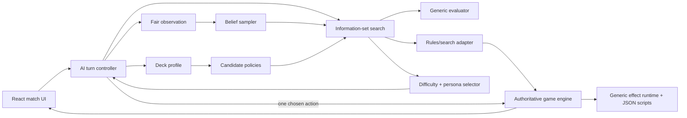

# Hyperverse TCG — Generic, Believable AI Architecture

**Status:** implementation in progress — canonical actions, two-sided belief sampling, generic profiles, mulligans, shallow search, and difficulty controls are playable
**Date:** 2026-08-20  
**Scope:** solo opponent, automated playtesting, and a reusable decision engine for arbitrary legal decks  
**Repository sources of truth:** [rules](./Hyperverse_TCG_Rules_SSOT_2026-08-12.md), [effect scripting](./EFFECT_SCRIPTS.md), [engine](../src/game/engine.ts), [runtime types](../src/game/types.ts), and [effect vocabulary](../src/game/effectTypes.ts)

## 1. Executive decision

Hyperverse should use a **fair, belief-aware, portfolio-guided Information Set Monte Carlo Tree Search (ISMCTS) agent**, backed by the real game engine and a generic state evaluator. It should not use a larger collection of card-specific `if` statements, and it should not begin with a neural network or an LLM.

The finished opponent will:

- ask the engine for every legal action, including choices inside card effects;
- simulate those actions with the same executable card scripts used by live matches;
- reason across a complete turn instead of following a fixed phase script;
- sample dice, draws, and plausible opponent hidden cards without reading private state;
- infer a usable plan from the AI deck's costs, types, stats, and effect scripts at match start;
- recognize combinations because their simulated state transitions are valuable, not because a programmer named the combination;
- replan after every visible action, roll, reaction, or revealed card;
- support multiple skill levels by changing search quality and selection precision, never by cheating;
- make occasional plausible mistakes on lower levels without playing illegal, random, or obviously self-destructive moves;
- expose deterministic seeds and decision traces for tests and balance tooling.

This is the best fit for the codebase. Hyperverse already has a generic interpreter: 159 card effect scripts are expressed through a shared operation vocabulary, and each script has a corresponding gameplay test. That means the expensive part of a general TCG AI—a simulator that understands new cards—largely exists already. The missing foundation is a complete legal-action interface and an AI controller built around it.

### Definition of “any deck works immediately”

A newly constructed legal deck is AI-playable without adding card IDs, card names, archetype names, combo lists, or weights to AI code, provided that:

1. every card has a valid executable effect script;
2. every decision the script can create is exposed through the canonical legal-action API;
3. the simulator can resolve every operation in that script;
4. any genuinely new rules primitive adds its semantics once at the engine/evaluator boundary.

A new card composed from existing operations should require **zero AI changes**. A new operation such as a future “copy an attack” primitive may require one generic engine and feature-extraction update, but still no per-card AI logic.

## 2. Player experience target

The AI is successful when players describe it as thoughtful, readable, fair, and varied—not merely when it has a high win rate.

### What the player should observe

- It develops Energy that fits both its hand and likely future draws.
- It plays Units into rows for a reason: pressure, protection, Backguard access, or future Rotation.
- It uses removal and Conditions on valuable targets rather than the first target.
- It sequences setup before payoff: buffs before attacks, Conditions before Condition rewards, draw/search before committing, and removal before combat when that opens better attacks.
- It considers lethal damage, prevents opposing lethal, and trades resources coherently.
- It advances a Construction only when the tempo cost is justified.
- It uses activated abilities, Equipment, reactions, Effect Die abilities, alternate wins, Rotation, and optional choices.
- It sometimes keeps Energy Ready for a later attack or reaction.
- It does not know the player's hand or deck order unless a rule revealed them.
- Easier opponents still appear to have a plan. Their mistakes are late, greedy, overly safe, or tactically shallow—not nonsensical.
- Actions arrive at a readable cadence, with important rolls and choices visible.

### What the player must never observe

- illegal actions or an unresolved AI choice that stalls the match;
- perfect counters selected from information the AI could not know;
- fixed “first card / first slot / first target” behavior;
- the same complete turn every time despite equivalent alternatives;
- arbitrary refusal to use a deck's defining mechanic;
- long unexplained freezes;
- fake thinking time after the decision is already visible;
- rubber-banding that secretly changes draws, rolls, card costs, or available information.

## 3. Legacy baseline and current implementation

The replaced baseline is a deterministic action pipeline in `runOpponentTurn` and `runOpponentStep` in [engine.ts](../src/game/engine.ts):

1. play the first Energy in hand;
2. play the first affordable Unit into the first open Vanguard slot, otherwise Backguard;
3. play the first affordable Utility;
4. advance the first affordable Construction;
5. for each Ready Vanguard Unit, use the first affordable damaging attack;
6. target the first opposing Vanguard Unit;
7. end the turn.

The UI advances this pipeline one visible step every 700 ms. That pacing mechanism is useful and should stay, but it is presentation—not intelligence.

The legacy functions remain temporarily for regression coverage, but player-facing matches no longer call them. The UI now advances `runStrategicOpponentStep` one visible action every 700 ms. The controller samples hidden cards from the selected public deck list, scores multiple chance outcomes, searches several alternating decisions, commits one live action, and replans.

### Baseline capability comparison

| Area | Legacy behavior | Required behavior |
|---|---|---|
| Turn planning | Fixed stage order | Search arbitrary legal sequences through End Turn |
| Energy | First Energy | Consider color demand, flexibility, current hand, and future curve |
| Units | First affordable; Vanguard-first | Score card, timing, row, slot, SUPER limit, and future actions |
| Utilities | First affordable | Evaluate targets, timing, persistent value, and opportunity cost |
| Constructions | First advanceable | Compare Completion progress with immediate tempo |
| Attacks | First damaging attack | Consider every attack, source, target, cost, expected result, and sequence |
| Activated abilities | Ignored | Enumerate and search them |
| Rotation | Ignored | Use for access, protection, attacks, and forced Vanguard management |
| Choices | AI can stall or accept the first automatic response | Search targets, orders, optional selections, reactions, and pass |
| Mulligan | Only the human receives the current mulligan flow | AI chooses up to three cards using its deck profile |
| Hidden information | Raw state is available to the engine code | AI receives a masked observation and sampled beliefs only |
| Randomness | One real roll determines the result | Search expected distributions through many seeded simulations |
| Strategy | No deck understanding | Infer needs and synergies from definitions and effect scripts |
| Difficulty | One behavior | Calibrated search/selection profiles with the same rules and information |
| Diagnostics | Game log only | Reproducible decision trace, candidate values, budget, and belief summary |

### Remaining implementation gaps

Canonical actions, mulligans, AI-owned choices, reactions, Effect Die actions, legal targets, fair known-list sampling, generic deck profiles, deterministic traces, and selectable difficulty budgets are implemented. The remaining gaps are:

- `GameState` still mixes authoritative rules with presentation fields such as `isOpponentActing` and the now-legacy `opponentStage`.
- Belief state is reconstructed per decision; persistent memory for temporarily revealed cards is not yet modeled.
- The current bounded minimax scaffold is not yet full information-set MCTS with availability counts, tree reuse, or synergy-guided rollouts.
- Search still runs synchronously on the UI thread and simulations still construct presentation logs; a cancellable worker and headless simulation mode remain necessary for larger budgets.
- The old fixed opponent functions remain in `engine.ts` until tournament parity and all calling tests are migrated.
- Several rules remain explicitly undecided in the SSOT, especially full reaction priority and some forced movement/equipment cases. Search deliberately reaches these edge cases more often.

## 4. Research synthesis

TCG play is not one problem. It combines a large sequential action space, chance, imperfect information, long-term resource planning, tactical combinations, and an experience-design requirement that the opponent feel believable.

### 4.1 Why scripts alone do not scale

Rules such as “play the cheapest Unit” or “attack the lowest-HP target” can make a prototype move, but each new mechanic creates exceptions. The resulting policy becomes card-specific, order-dependent, hard to test, and unable to discover interactions. Hyperverse's 15 current deck presets already span aggro, control, recursion, ramp, swarm, Construction, Condition, Equipment, sacrifice, dice, and alternate-win behavior. A fixed priority list cannot express all of them coherently.

Research competitions reach the same conclusion. The five-year Legends of Code and Magic competition treated collectible card games as a combination of large action spaces, long-term planning, imperfect information, randomness, evaluation, and deck building; successful entrants used search, learned policies/evaluators, and other optimization methods rather than a single universal greedy rule ([Kowalski and Miernik, 2023](https://arxiv.org/abs/2305.11814)). The Hearthstone AI Competition likewise identifies deck variety, synergy, randomness, and restricted information as central difficulties ([Dockhorn and Mostaghim, 2019](https://arxiv.org/abs/1906.04238)).

### 4.2 Why search over the real simulator is the right first foundation

Monte Carlo Tree Search repeatedly selects promising actions, expands alternatives, simulates future play, and backs results up to earlier decisions. Its “anytime” nature lets the same implementation use a small or large decision budget.

Card-game evidence is particularly relevant:

- An ensemble-determinization MCTS for a simplified Magic: The Gathering variant became competitive with a sophisticated expert rules player without encoding that player's expert knowledge. The study found that focused branching and stochastic but informed rollouts were important; uniformly random rollouts were weak, while a completely deterministic rollout policy was also inferior ([Cowling, Ward, and Powley, 2012](https://eprints.whiterose.ac.uk/id/eprint/75050/1/EnsDetMagic.pdf)).
- Hearthstone experiments found that MCTS guided by a deck database and heuristic outperformed vanilla MCTS across aggro, control, and midrange decks. The authors specifically identify full-turn optimization and strategy-aware rather than deck-specific evaluation as future directions ([Santos, Santos, and Melo, 2017](https://fenix.tecnico.ulisboa.pt/downloadFile/1970719973966524/paper.pdf)).
- Prismata's Hierarchical Portfolio Search reduces enormous move spaces by asking a small portfolio of coherent tactical policies to propose candidate partial moves, then searching combinations of them. Its architecture survived many balance changes without significant behavior changes, which is precisely the robustness Hyperverse needs ([Churchill and Buro, 2015](https://davechurchill.ca/publications/pdf/aiide15_churchill_prismata.pdf)).

Hyperverse has an additional advantage over those early systems: the card effects are already executable data. The AI does not have to understand prose such as “Vanquish target Unit”; it can ask the engine what the legal target choices are and simulate each outcome.

### 4.3 Hidden information needs an explicit model

A normal minimax or perfect-information MCTS that receives the raw `GameState` will cheat, even if no developer intended it to. It can condition its move on the player's actual hand and deck order.

Naive determinization samples one possible hidden state, then searches it as if it were known. That is useful but can suffer from **strategy fusion**—choosing different actions in states the acting player cannot distinguish—and poor allocation of simulations. ISMCTS instead builds the tree around information sets and was introduced specifically for hidden information and uncertainty ([Cowling, Powley, and Whitehouse, 2012](https://eprints.whiterose.ac.uk/id/eprint/75048/)). POMCP demonstrates the related idea of maintaining a sampled belief and planning with only a black-box simulator in very large partially observable problems ([Silver and Veness, 2010](https://papers.nips.cc/paper/2010/hash/edfbe1afcf9246bb0d40eb4d8027d90f-Abstract.html)).

For Hyperverse, the practical design is single-observer ISMCTS/open-loop search:

- the AI tree is keyed by what the AI can observe and the action/observation history;
- each simulation samples a complete hidden state consistent with that observation;
- actual hidden hand contents and deck order never enter the decision API;
- actions that are legal only in some sampled states are handled by availability counts;
- the AI replans as cards are drawn, played, searched, or revealed.

### 4.4 Search needs focus, not blind breadth

A TCG turn may contain many orderings of plays, attacks, rotations, targets, and choices. More raw simulations do not automatically fix bad branching. The Magic study found that reducing the tree's degree focused computation and could outperform spending a larger budget on arbitrary branches. Prismata similarly searches a portfolio of strategically coherent proposals instead of every combinatorial full-turn move.

Hyperverse should therefore enumerate all legal **atomic** actions for correctness, then rank and progressively admit them into search. Generic candidate proposers can prefer actions such as:

- immediate lethal and lethal prevention;
- Energy that unlocks the most current and near-curve costs;
- removal or disabling effects against high-threat Units;
- a draw/search action before committing other resources;
- setup effects before payoffs they enable;
- attacks with favorable expected damage or surplus;
- protection before exposing a key Unit;
- keeping enough Energy Ready for a high-value reaction;
- End Turn when further actions lose value.

These are proposals, not hard-coded decisions. The search may reject them, and progressive widening eventually admits less obvious legal actions when the budget allows.

### 4.5 Strong is not the same as fun or human-like

Research on a commercial Spades game found that an MCTS agent's emergent style was measurably different from human play. Biasing search with a learned human action model increased human-likeness while retaining competitive strength ([Baier et al., 2018](https://repository.falmouth.ac.uk/2872/)). Prismata also treated tutorial usefulness, replayability, robustness, difficulty, wait time, and experienced-player practice as first-class AI requirements, not side effects of win rate. Its shipped difficulty levels changed portfolios and search budgets, and its hardest agent used randomized input timing during human-facing evaluation ([Churchill and Buro, 2015](https://davechurchill.ca/publications/pdf/aiide15_churchill_prismata.pdf)).

Hyperverse should keep three concerns separate:

1. **competence:** estimate which actions are good;
2. **persona:** express preferences among similarly good actions;
3. **presentation:** pace and explain the chosen actions.

This separation prevents a common failure: weakening an opponent by making it random. A lower difficulty should search less deeply and sometimes choose a plausible runner-up within a bounded regret window. It should not ignore lethal, throw away a SUPER Unit for no benefit, or select targets uniformly at random.

### 4.6 Where learned models fit later

Self-play and learned policy/value functions can eventually replace expensive rollouts or improve action priors. AlphaZero showed the power of combining self-play policy/value learning with tree search in perfect-information games ([Silver et al., 2017](https://arxiv.org/abs/1712.01815)); modern general frameworks such as OpenSpiel distinguish perfect/imperfect information and provide reference implementations of search, reinforcement learning, and game-theoretic algorithms ([Lanctot et al., 2019](https://arxiv.org/abs/1908.09453)). RLCard provides comparable environment interfaces and baselines for card games ([Zha et al., 2019](https://arxiv.org/abs/1910.04376)).

Imperfect information makes “just use AlphaZero” unsafe. Neural Fictitious Self-Play and Deep CFR are designed to approach equilibrium strategies in imperfect-information games ([Heinrich and Silver, 2016](https://arxiv.org/abs/1603.01121), [Brown et al., 2019](https://arxiv.org/abs/1811.00164)), and Student of Games combines guided search, self-play, and game-theoretic reasoning across both information regimes ([Schmid et al., 2021](https://arxiv.org/abs/2112.03178)). These are valuable R&D directions after Hyperverse has a fast, correct environment and large self-play corpus. They are not the first production milestone: they add training infrastructure, model versioning, reproducibility, and new failure modes without removing the need for legal actions, fair observations, and simulation.

## 5. Architectural boundaries

The AI must depend on a narrow rules interface. It must not reach into React, mutate the live state, call card-specific helpers, or inspect hidden zones.



### 5.1 Canonical action model

Introduce a discriminated union representing every decision a player can make:

```ts
type GameAction =
  | { kind: 'mulligan'; cardIds: readonly string[] }
  | { kind: 'play-energy'; cardId: string }
  | { kind: 'play-unit'; cardId: string; destination: BoardAddress }
  | { kind: 'play-utility'; cardId: string }
  | { kind: 'advance-construction'; cardId: string }
  | { kind: 'rotate-unit'; source: BoardAddress }
  | { kind: 'activate-ability'; sourceId: string; abilityId: string }
  | { kind: 'attack'; source: BoardAddress; attackIndex: number; target: BoardAddress | null }
  | { kind: 'resolve-choice'; choiceId: string; selectedIds: readonly string[] }
  | { kind: 'end-turn' };
```

Instance IDs, not card IDs, should identify live cards in the final type; the abbreviated example emphasizes shape. Ordered choices must preserve order, optional choices must include the empty selection, and reaction windows must represent `pass` as an ordinary legal choice.

The engine owns:

```ts
interface RulesSearchPort {
  observe(state: GameState, viewer: PlayerId, knowledge: KnowledgePolicy): GameObservation;
  listLegalActions(state: GameState, actor: PlayerId): readonly GameAction[];
  applyAction(state: GameState, action: GameAction, random: RandomSource, mode: 'live' | 'simulation'): GameResult;
  isTerminal(state: GameState): boolean;
}
```

This is a real module boundary: UI controls, AI search, tests, replays, and future multiplayer validation all need the same action vocabulary. There must be one legality source. `listLegalActions` should be built from the existing `...ActionError`, `availableAttacks`, `availableActivatedAbilities`, and `pendingChoice` contracts; those checks should not be copied into AI code.

### 5.2 Fair observation

`GameObservation` must omit or redact:

- identities of cards in the opponent's hand unless revealed;
- opponent deck order and card instance IDs;
- face-down Vanquished cards;
- unrevealed search results;
- future random values and RNG state;
- internal continuation details that expose hidden selections.

It should include:

- all public zones and public counters;
- the AI's own hand and known deck composition;
- opponent hand size and deck size;
- cards explicitly revealed by rules, including their duration if temporary;
- complete public action history needed to update beliefs;
- the legal actions currently available to the acting AI.

The search process must never receive the live `GameState` directly. Only the belief sampler may produce private **simulation copies**, and those copies must be constructed from legal knowledge rather than copied from the real hidden state.

### 5.3 Knowledge policies

Make opponent knowledge explicit and testable:

- **Declared list:** both deck lists are known before play. This is simplest for current preset matches and mirrors open-deck-list formats.
- **Known preset:** the opponent preset identity is known, but its shuffle and hand are hidden.
- **Inferred list:** the list is unknown; begin from the legal card pool or archetype prior and update from observed cards. This is future-facing and much more expensive.
- **Debug omniscient:** can inspect everything for diagnostics only; it must be impossible to select this profile in a player-facing build.

Current Quick Play shows the selected opponent deck and all presets are locally defined, so **known preset** is the recommended launch policy. Whether the AI should also know the human's exact selected list is a product decision; it must be surfaced in configuration, not smuggled in through raw state access.

## 6. Decision pipeline

Every AI decision follows the same steps regardless of deck or card:

1. Build the current fair observation.
2. Update the belief from public actions and reveals.
3. Enumerate canonical legal actions.
4. Run tactical safety checks for forced wins/losses.
5. Ask generic portfolio policies to rank or propose candidates.
6. Run information-set search under a deterministic iteration/time budget.
7. Convert search statistics into candidate utility.
8. Apply difficulty and persona selection within the allowed regret band.
9. Emit a compact decision trace.
10. Execute exactly one live action.
11. Wait for its animation/roll/choice to become visible, then replan.

Replanning after one action is intentional. A complete-turn search is still used to value sequences, but only its first action is committed. This prevents a cached plan from ignoring a Critical Hit, failed attack, reaction, shuffled search result, trigger, or newly revealed card.

### 6.1 Tactical safety pass

Before general search, run bounded generic solvers for:

- guaranteed lethal this decision/turn;
- opponent guaranteed lethal on the next turn;
- forced prevention of deck-out or alternate loss;
- immediate alternate-win actions;
- actions whose only legal continuation is forced.

This is not card-specific scripting. It is a small proof search using legal actions and terminal states. On Normal and above, a proven win should not be discarded by personality noise. On Easy, the solver may use a shallower proof horizon, but it should still understand visible one-action lethal.

### 6.2 Candidate portfolio

All actions remain legal search candidates. A portfolio only orders expansion and creates useful rollout policies.

Recommended generic partial policies:

- **Develop:** improve Energy availability and deploy efficient persistent value.
- **Pressure:** maximize expected player/surplus damage while preserving credible follow-up.
- **Control:** reduce the opponent's future legal/valuable actions.
- **Protect:** reduce next-turn loss and preserve high-value engines.
- **Value:** maximize cards, searches, recursion, healing, and favorable exchanges.
- **Synergy:** prefer actions whose state delta increases the value of another affordable action.
- **Construction:** balance Completion progress against current tempo.
- **Alternate win:** advance any script-defined direct-win condition.
- **Pass/hold:** preserve Energy or optional effects when spending now has lower expected value.

The portfolio is generic because it consumes state deltas and script features. It never says “if card is Endymion, recur Spectres.” It says “this action moves a selectable Unit from Vanquished to field/hand and increases future board/value under the current type constraints.”

### 6.3 Search algorithm

Use a single-observer ISMCTS/open-loop tree with UCT-style selection and progressive widening.

At each simulation:

1. sample an opponent hand and both unknown deck orders from the current belief;
2. sample future chance outcomes using the simulation RNG;
3. traverse nodes keyed by information-visible history, not sampled private state;
4. select among actions legal in that determinization, tracking each action's availability count;
5. expand a high-ranked unvisited action;
6. simulate with a stochastic, portfolio-guided rollout policy;
7. evaluate a terminal state or horizon state;
8. back up the result to visited information-set nodes.

Important implementation policies:

- Use an iteration budget in deterministic tests and a wall-clock budget in the UI.
- Search to at least the end of the current turn; harder levels should cross the opponent reply and return to the AI's next decision when budget allows.
- Treat `pendingChoice` as a normal decision node. Do not auto-resolve targets during simulation unless the rollout policy is controlling that node.
- Include `End Turn` at every legal action node. Otherwise the AI will spend resources merely because actions exist.
- Use progressive widening so cheap budgets see strong candidates first while larger budgets can discover unusual combinations.
- Reuse stable root statistics only when the new observation matches the expected child. Discard the tree after unexpected information.
- Use transposition keys derived from the observation, acting player, pending choice, public history needed by effects, and the AI's own private knowledge. Never hash the real opponent hand into an information-set key.
- Bound loops using action count, repeated-state detection, and turn horizon. Activated effects and Ready loops must not create infinite rollouts.

## 7. Generic deck understanding

Search can technically play any deck with no profile, but a pre-match deck analysis makes limited budgets much stronger and improves mulligans/rollouts.

### 7.1 Static deck profile

Compile a `DeckProfile` from definitions and effect ASTs:

- Energy count by type;
- Unit/Utility/Energy density;
- play-cost and attack-cost curves;
- earliest likely playable turn for each card/action;
- colored-cost pressure and `any` flexibility;
- number of proactive and reactive plays at each cost;
- Unit HP, DEF, attack, row, and readiness distribution;
- card movement: draw, search, recursion, discard/bottom-deck, Vanquish;
- removal and disruption: Damage, direct Vanquish, Conditions, Exhaust, Rotation, cost increase, cannot-act modifiers;
- sustain and protection: heal, prevent Vanquish, DEF/HP, immunity, cannot-target;
- economy: extra Energy plays, Energy search/recovery/control, Construction investment;
- alternate win operations;
- dice dependence and outcome variance;
- selector dependencies on Type, Subtitle, Condition, row, cost, Utility class, attachment, or Construction state.

### 7.2 Synergy graph

Build a weighted graph with cards/capabilities as nodes and producer-consumer relationships as edges. Examples:

- an effect applies `weakened`; another selector rewards a Unit with a Condition;
- a card adds a functional Type; another counts or buffs that Type;
- an effect Vanquishes an allied card; another listens for `unit-vanquished` or recurs from the pile;
- Equipment grants an attack; a Unit or modifier rewards attacking;
- a Construction's Completed Effect enables an activated ability;
- Energy acceleration reduces the effective arrival time of expensive cards.

Edges come from the shared effect vocabulary and selectors. They do not require a human-authored combo database. The deck profile may expose human-readable labels for diagnostics, but labels must not drive correctness.

### 7.3 Dynamic game plan

At each turn, derive a small set of strategic weights from:

- relative HP and credible lethal clocks;
- board strength and open rows;
- cards and Energy available now;
- remaining deck profile and decking risk;
- Construction progress;
- inferred opponent speed, removal, reaction, and alternate-win pressure;
- whether the AI is ahead or behind and should prefer low or high variance.

This produces a continuum rather than a brittle archetype enum. A nominal control deck can become the aggressor after stabilizing; an aggro deck can protect a winning board instead of blindly committing.

## 8. State evaluation

The evaluator estimates the AI's probability-adjusted advantage from a state. Terminal outcomes dominate everything else.

```text
value = terminal
      + survival and lethal pressure
      + board presence and expected survivability
      + actionable damage and control
      + Energy development and color flexibility
      + hand/deck resource value
      + persistent Utility and Construction value
      + Condition/modifier value
      + tempo and initiative
      + alternate-win progress
      - exposed risk and opponent counterplay
```

### 8.1 Required evaluation properties

- **Antisymmetric where appropriate:** swapping players should negate the zero-sum value.
- **Nonlinear near victory:** 20 Damage matters more when it creates lethal than when both players are at 250 HP.
- **Action-aware:** a Ready Unit with an affordable attack is worth more than an otherwise equal Exhausted or locked Unit.
- **Survival-aware:** current HP, max HP, DEF distribution, Critical ranges, Conditions, and prevent-Vanquish effects affect expected lifetime.
- **Resource-aware:** Ready Energy and color coverage matter this turn; total Energy and curve coverage matter later.
- **Position-aware:** Vanguard/Backguard value depends on available attacks, targetability, open slots, and forced promotion.
- **Timing-aware:** temporary modifiers are valued by the actions remaining before expiry.
- **Uncertainty-aware:** use expected value across samples, plus a difficulty/persona risk preference—not the best sampled future.
- **Mechanic-complete:** direct-win scripts, deck-out, SUPER surplus, face-down information, Equipment loss, and Construction progress need explicit state features.

### 8.2 Expected outcomes

For short tactical branches, enumerate small chance distributions when cheap; otherwise sample them. The simulator already models the Critical d20, Defense d100, effect dice, Condition coin flips, and random shuffle/draw. Search should compare expected utility and variance across repeated seeds.

Risk preference should be contextual:

- while ahead, slightly prefer lower-variance lines that preserve a winning state;
- while behind, accept higher variance when low-variance lines are likely losses;
- personality may adjust this bias within a safe range.

### 8.3 Delta-based semantic features

The most robust generic card valuation is the result of applying it:

- cards drawn or moved to useful zones;
- HP and player HP changed;
- Units removed, disabled, protected, or made actionable;
- Energy spent, gained, exhausted, or preserved;
- modifiers, Conditions, attachments, reveals, and Completion changed;
- legal follow-up action count and quality changed;
- opponent reply quality changed.

Static AST features help order candidates before simulation. Simulated state delta decides their actual value. This is how a new card can be useful immediately even when its combination was never named by a designer.

## 9. Hidden-information belief model

### 9.1 Known preset algorithm

Given a known opponent list:

1. start with its multiset of card definitions;
2. subtract every publicly observed card in play, Vanquished, revealed, or otherwise known;
3. preserve any known top/bottom order created by an effect;
4. account for returned, shuffled, controlled, or face-down cards without revealing identity illegally;
5. sample the required hand size from remaining unknown cards;
6. sample a deck order from the remainder;
7. reject samples inconsistent with public action history only when that inference is logically valid.

The AI should infer **possibility**, not mind-read intent. If the opponent left Muon Energy Ready and a compatible Free Effect remains possible, search should include that response in some samples. It should not assert that the response exists.

### 9.2 Belief updates

Record public observations as typed events:

- card played/revealed/drawn from a known location;
- search size and public result;
- shuffle, top/bottom placement, and return to hand/deck;
- face-down movement;
- hand-size change;
- action passed while specific reactions were legally possible.

Passing can weakly update an optional opponent model later, but the baseline sampler should avoid aggressive behavioral inference. A player may intentionally hold a legal response.

### 9.3 Fairness tests

- Changing the real opponent hand while preserving the AI observation must not directly change the selected action under the same belief/search seeds.
- Changing unrevealed deck order must not directly change the selected action.
- Revealing a card may change the decision.
- A face-down Vanquished identity must not affect the decision until a rule reveals it.
- The debug omniscient policy must be excluded from production configuration tests.

## 10. Difficulty, personality, and believability

Difficulty is a configuration over the same competent engine.

| Profile | Search | Belief | Candidate choice | Tactical guard | Intended feel |
|---|---|---|---|---|---|
| Initiate | Current turn, small budget | Few samples | Soft choice among plausible top actions; wider regret cap | Visible immediate lethal only | Teaches rules and gives openings |
| Challenger | Full turn plus shallow reply | Moderate samples | Mild temperature; bounded mistakes | Lethal and one-turn defense | Coherent casual opponent |
| Veteran | Multi-turn where budget permits | Strong sampling | Usually best action; small style variation | Full bounded solver | Punishing, fair practice |
| Master | Largest budget, tree reuse, widest candidates | Most samples | Best robust action | Deepest solver | Maximum production strength |

Concrete budgets must be measured on target hardware. A reasonable starting experiment is approximately 75–150 ms, 250–400 ms, 600–900 ms, and 1,200–2,000 ms per visible decision, executed in a Web Worker. UI pacing can ensure a minimum readable beat without forcing the search to consume that whole delay.

### 10.1 Bounded plausible mistakes

After search, compute regret relative to the best estimated action. Lower levels may sample among actions within a configured regret cap:

```text
P(action) proportional to exp((value(action) + personaBias(action)) / temperature)
```

Safety filters remove actions that:

- miss a proven immediate win above that level's tactical horizon;
- allow a proven immediate loss when a legal prevention exists;
- create a grossly negative exchange outside the level's regret cap;
- repeat a state without strategic gain;
- spend resources for no observable or probabilistic benefit.

This creates recognizable mistakes: deploying one threat too many, choosing the second-best target, taking a risky roll, or valuing a Construction too early. It avoids comedy-random behavior.

### 10.2 Personas

Personas add small biases to near-equal actions:

- **Aggressive:** values pressure, surplus, and initiative.
- **Methodical:** values resource efficiency and low variance.
- **Trickster:** values optionality, reactions, Conditions, and less common lines.
- **Builder:** values engines, Equipment, and Construction completion.

The deck profile should choose a compatible default blend, while campaign encounters may select a named persona. Persona bias must never overpower terminal results or large tactical differences.

### 10.3 Adaptive difficulty

Do not silently rubber-band the default match. If adaptive difficulty is desired later, label it and adjust only between matches using outcomes such as recent win rate, remaining HP, and detected tactical errors. Never alter RNG, deck order, card stats, hidden knowledge, or rules mid-match.

### 10.4 Presentation

- Preserve the existing one-action pacing and dice-overlay synchronization.
- Add small bounded latency variation after search, not during tests.
- Use shorter pauses for forced/no-choice actions and longer pauses for major attacks or multi-target effects.
- Highlight the source and target before resolving a complex AI choice.
- Log public rationale at a safe level, such as “protected its Vanguard” or “advanced its Construction,” without exposing sampled hidden cards or numeric search values.
- Provide a developer-only trace with seed, observation hash, candidates, visits, mean value, variance, selected regret, belief summary, and elapsed time.

## 11. Integration design

### 11.1 Proposed modules

```text
src/game/
  actions.ts                  canonical GameAction, listLegalActions, applyAction
  observation.ts              masking and knowledge policy
  simulation.ts               seeded headless rules adapter
  ai/
    types.ts                  profiles, traces, search contracts
    controller.ts             one-decision orchestration and cancellation
    belief.ts                 hidden-state particles/sampling
    deckProfile.ts            static capability and synergy compilation
    candidates.ts             generic portfolio proposals and ordering
    evaluate.ts               state/terminal evaluation
    tactical.ts               bounded lethal and loss-prevention solver
    ismcts.ts                 search tree, widening, rollout, backup
    difficulty.ts             budget, temperature, regret, persona
    worker.ts                 off-main-thread entry point
  aiTests/
    actionParity.testHarness.ts
    informationLeak.testHarness.ts
    tacticalScenarios.testHarness.ts
    deckTournament.testHarness.ts
```

Names may change during implementation, but responsibilities should remain cohesive. Avoid an `AIManager` god object.

### 11.2 Existing file changes

- [engine.ts](../src/game/engine.ts): remove `affordable`, `advanceableConstruction`, `runOpponentTurn`, and `runOpponentStep` after the new controller reaches parity; expose canonical actions instead.
- [types.ts](../src/game/types.ts): separate match rules state from `isOpponentActing`/`opponentStage` presentation state; add observation-safe types.
- [effectRuntime.ts](../src/game/effectRuntime.ts): offer AI Effect Die actions, route all reaction/choice decisions through `pendingChoice`, and support simulation mode without changing semantics.
- [useGame.ts](../src/game/useGame.ts): request one asynchronous AI decision, reject stale responses by observation/action sequence, and execute through `applyAction`.
- [GameApp.tsx](../src/ui/GameApp.tsx): keep visual pacing, expose “AI thinking,” and avoid scheduling a second worker request while one is active.
- [deck.ts](../src/game/deck.ts): provide list composition to the deck profiler; remove any assumption that presets are the only AI decks.

### 11.3 Live versus simulation mode

Both modes must execute identical rules. Simulation mode may disable or compact:

- human-readable game-log construction;
- animation-specific `lastRoll` details;
- presentation-only sequence increments;
- deep cloning of immutable definitions.

Do not create a second approximate rules engine. Start by using the existing engine unchanged in rollouts. Profile, then optimize the same transition functions behind a mode flag with differential tests asserting identical rule state for the same action and RNG stream.

### 11.4 Randomness

Replace naked `() => number` at the AI boundary with a seeded `RandomSource` exposing named or forked streams:

- live match RNG;
- belief sampling RNG;
- search selection/rollout RNG;
- difficulty/persona RNG;
- presentation timing RNG.

Search must never advance live match RNG. Tests must reproduce a decision from the match seed, observation hash, AI profile, and search iteration budget.

### 11.5 Concurrency and cancellation

Search should run in a Web Worker so React animations and input remain responsive. The worker receives a serialized observation, deck profiles, public history, profile, and seed—not the live state object. Every request carries an observation/action sequence. The UI discards a result if the match changed, restarted, ended, or left the screen before completion.

## 12. Implementation roadmap

Each milestone leaves the game in a testable state. Do not begin neural training before Milestone 6 has reliable tournament data.

### Milestone 0 — resolve rules and define information policy

- Decide the launch reaction window/priority rules.
- Confirm turn sequence and draw/deck-out timing.
- Confirm forced promotion behavior.
- Confirm Equipment movement edge cases.
- Decide whether Quick Play uses open player deck lists or only known opponent presets.
- Record these decisions in the rules SSOT before encoding search assumptions.

**Exit:** no AI-reachable engine decision depends on an unresolved rule.

### Milestone 1 — canonical action surface

- Add `GameAction`, `listLegalActions`, and `applyAction`.
- Cover mulligan, every ordinary action, End Turn, pass, and every `pendingChoice` shape.
- Route human UI actions through the same command path where practical.
- Add action-parity and no-deadlock property tests.

**Exit:** a random legal-action agent can finish seeded games using every preset without illegal actions or stalls.

### Milestone 2 — fair observation and deterministic simulation

- Add observation masking and known-preset belief sampling.
- Separate live RNG from search RNG.
- Add headless simulations and differential rule-state tests.
- Add information-leak tests.

**Exit:** simulation is reproducible, fair, and behaviorally identical to live rules.

### Milestone 3 — generic evaluator and one-turn planner

- Add terminal/tactical evaluation and state-delta features.
- Compile basic deck cost/capability profiles.
- Implement beam search or a shallow open-loop planner as an integration scaffold.
- Replace the fixed opponent pipeline behind a feature flag.

**Exit:** all decks mulligan, develop, choose targets, use abilities, attack, react, and end turns coherently; it decisively beats the legacy bot across both seats.

### Milestone 4 — belief-aware ISMCTS and candidate portfolios

- Add the information-set tree, progressive widening, availability counts, and guided stochastic rollouts.
- Add synergy graph and dynamic strategic weights.
- Search full turns and shallow replies, committing one action at a time.
- Move search to a worker and add cancellation.

**Exit:** stable latency on target hardware and materially improved tournament results over the one-turn planner across all presets.

### Milestone 5 — difficulty, personality, and player-facing polish

- Calibrate search budgets, regret caps, temperature, and tactical horizons.
- Add personas and public rationale tags.
- Tune decision cadence and important-action emphasis.
- Run blinded human playtests for fairness, predictability, variety, and fun.

**Exit:** difficulty order is statistically monotonic, no level cheats, and playtesters can distinguish style/strength without reporting nonsense behavior.

### Milestone 6 — automated balance and regression platform

- Run seeded round robins across every deck and both seats.
- Store compact decision/game traces.
- Report matchup win rate, first-player advantage, game length, action diversity, card usage, unplayed cards, alternate-win frequency, stalls, and latency.
- Add new-card onboarding gates.

**Exit:** a card or deck change can be evaluated automatically and regressions are reproducible.

### Milestone 7 — optional learned priors/value model

- Collect self-play and consenting human action data using stable schemas.
- Train a card/order-invariant policy/value model on observation and legal-action features.
- Use it first for candidate priors and leaf evaluation, never legality.
- Compare against the search-only agent with held-out cards/decks.
- Keep the heuristic/search fallback for unsupported models and debugging.

**Exit:** the model improves strength or human-likeness on unseen deck compositions without increasing illegal actions, information leakage, or unacceptable latency.

## 13. Verification strategy

### 13.1 Correctness gates

- **Legal action soundness:** every enumerated action executes without an error on the unchanged state.
- **Legal action completeness:** every UI-permitted or script-created player decision has an equivalent action.
- **Choice completion:** every AI-owned pending choice resolves or passes within one controller request.
- **Termination:** seeded AI-vs-AI matches end or hit an explicit maximum-turn draw policy; none stalls.
- **Rule equivalence:** live and simulation transitions match after presentation fields are removed.
- **No card branches:** static check forbids card ID/name comparisons under `src/game/ai`.
- **Determinism:** fixed state, observation, profile, iteration budget, and seed produce the same action/trace.
- **Information safety:** hidden-state mutation tests described in Section 9.3 pass.

### 13.2 Tactical scenario suite

Add readable scenarios for:

- take guaranteed direct lethal;
- choose surplus lethal over a nonlethal trade;
- prevent visible opposing lethal;
- remove the only Vanguard blocker before attacking;
- avoid attacking a target when the expected exchange is losing and passing is better;
- play draw/search before selecting an Energy or threat;
- use a Condition before a Condition payoff;
- equip the Unit that can use the granted attack;
- protect a key Unit from a known reaction;
- pass a reaction window when the reaction has no value;
- keep Energy Ready for a stronger attack/reaction;
- choose a legal Backguard target only when an effect permits it;
- Rotate for offense and Rotate for protection;
- advance versus delay a Construction in contrasting states;
- pursue and prevent a script-defined alternate win;
- mulligan an unplayable hand while keeping a functional curve;
- handle Cursed, Doomed, Infected, Tranquil, Cowering, and Paralyzed timing;
- value SUPER surplus risk;
- reason over Critical/Defense variance while ahead and behind.

The expected assertion is usually an acceptable action set or maximum regret, not a single brittle action. Several strategically equivalent choices should pass.

### 13.3 Tournament matrix

For every release candidate:

- every preset versus every preset;
- both seat orders;
- many fixed seeds per pairing;
- all difficulty profiles against adjacent profiles;
- new agent versus legacy and previous-release agents;
- search budget scaling tests;
- repeated matches with randomized equivalent slot order to detect positional bias.

Track confidence intervals, not only raw win rates. A stronger profile must beat the adjacent weaker profile by a statistically meaningful margin without a large rise in latency or match stalls.

### 13.4 Genericity gates for a new card or deck

A new card passes AI onboarding when:

1. its effect script and card scenarios pass;
2. every decision it generates appears in `listLegalActions`;
3. random agents can resolve it without stalls;
4. the deck profiler extracts its operations/selectors without unknown-feature warnings;
5. the AI uses it in at least some seeded states where it has positive simulated value;
6. no AI source file changed solely to recognize that card.

A new deck passes when the AI can complete matches, uses its Energy colors, demonstrates its high-weight capability edges in some seeds, and needs no new behavior configuration.

### 13.5 Player research

Automated win rate cannot validate “fun.” Run blinded comparisons and ask players to rate:

- fairness and suspected cheating;
- challenge relative to the selected label;
- action coherence;
- predictability/repetition;
- turn wait time;
- usefulness for learning and practice;
- whether mistakes felt plausible;
- desire to rematch.

Compare search-only, humanized selection, and previous-release agents. Use telemetry only with appropriate consent and retention rules.

## 14. Performance budgets and observability

Initial service-level targets, subject to measurement:

- no main-thread search work long enough to drop visible animation frames;
- median decision available before the current 700 ms presentation beat on Challenger hardware targets;
- hard upper timeout that returns the best fully evaluated action so far;
- zero live-match stalls from worker failure—fallback to the best portfolio candidate;
- deterministic iteration-based mode for CI;
- bounded memory per active match and discarded trees after match exit.

Developer trace example:

```json
{
  "observationHash": "...",
  "profile": "challenger",
  "seed": 184223,
  "elapsedMs": 286,
  "iterations": 4120,
  "beliefSamples": 48,
  "selected": "attack:unit-17:attack-1:target-8",
  "selectedValue": 0.42,
  "bestValue": 0.44,
  "selectedRegret": 0.02,
  "candidates": [
    { "action": "attack:unit-17:attack-1:target-8", "visits": 1204, "mean": 0.42 },
    { "action": "play-unit:unit-22:vanguard-3", "visits": 998, "mean": 0.44 }
  ],
  "rationaleTags": ["pressure", "favorable-trade"]
}
```

Never ship hidden belief particles or opponent-card probabilities in the player-visible log.

## 15. Risks and mitigations

| Risk | Consequence | Mitigation |
|---|---|---|
| Raw state leaks hidden cards | Unfair, uncanny counters | Observation-only AI API and mutation tests |
| Legal action enumeration is incomplete | New mechanics ignored or matches stall | Canonical action parity/property tests and new-card gate |
| Branching explodes | Slow or shallow decisions | Candidate portfolios, progressive widening, choice decomposition, profiling |
| Random rollouts are meaningless | Weak search despite high iteration count | Generic guided stochastic rollout policies |
| Evaluator overfits current decks | New decks fail | State-delta semantics, held-out deck/card tests, no card IDs |
| Simulation diverges from live rules | Search prefers impossible outcomes | One transition implementation and differential tests |
| Lower difficulty feels random | Unfun, non-educational opponent | Regret-bounded selection and tactical safety filters |
| Maximum strength feels robotic | Repetition and uncanny play | Near-equal variation, personas, human-model priors later, readable pacing |
| Rules remain ambiguous | Search exploits unintended edge cases | Resolve SSOT items before relevant milestone |
| Search blocks rendering | Poor UX | Web Worker, cancellation, anytime fallback |
| Learned model becomes mandatory | Fragile builds and opaque regressions | Search-only production baseline and versioned optional model |
| Balance changes invalidate tuning | Maintenance burden | Generic features, automated round robins, script-hash profile cache |

## 16. Acceptance criteria for the full feature

The “fully fledged AI” feature is complete when all of the following are true:

- The legacy fixed opponent pipeline is no longer used in player-facing matches.
- The AI can complete seeded matches with every legal deck using no per-card strategy branches.
- All ordinary actions, choices, reactions, abilities, attacks, rotations, mulligans, and End Turn are searchable.
- No AI-owned pending choice can stall a match.
- The AI cannot access actual hidden opponent cards, deck order, or future RNG in production.
- The AI demonstrates multi-action sequencing and deck mechanics across the current preset suite.
- It reliably takes visible lethal and defends against visible one-turn lethal on Challenger and above.
- Difficulty strength is statistically monotonic and uses no rule/RNG/information advantages.
- Lower levels make bounded, plausible mistakes instead of uniform random moves.
- Decisions meet measured UI latency budgets on supported hardware.
- Every decision is reproducible in CI from a seed and compact trace.
- Automated tournaments cover every deck pairing and seat order.
- Adding a card built from existing effect operations requires no AI code change.
- Blinded player tests rate the opponent as fair, coherent, and more enjoyable than the legacy bot.

## 17. Recommended first implementation slice

The first code change should **not** be MCTS. It should be the canonical action surface plus a random legal-action soak agent.

That slice proves the essential contract:

- the engine can enumerate everything a player may decide;
- AI choices cannot stall;
- live and automated play share legality;
- arbitrary decks and card scripts are structurally supported;
- seeded games can run headlessly to completion.

Once that is green, add the evaluator and shallow planner, then replace its search core with belief-aware ISMCTS. This order makes each change observable and keeps rules correctness separate from search sophistication.

## 18. Research references

Primary and authoritative sources used for this design:

1. Peter I. Cowling, Edward J. Powley, and Daniel Whitehouse, [“Information Set Monte Carlo Tree Search”](https://eprints.whiterose.ac.uk/id/eprint/75048/), *IEEE Transactions on Computational Intelligence and AI in Games*, 2012.
2. Peter I. Cowling, Colin D. Ward, and Edward J. Powley, [“Ensemble Determinization in Monte Carlo Tree Search for the Imperfect Information Card Game Magic: The Gathering”](https://eprints.whiterose.ac.uk/id/eprint/75050/1/EnsDetMagic.pdf), *IEEE Transactions on Computational Intelligence and AI in Games*, 2012.
3. André Santos, Pedro A. Santos, and Francisco S. Melo, [“Monte Carlo Tree Search Experiments in Hearthstone”](https://fenix.tecnico.ulisboa.pt/downloadFile/1970719973966524/paper.pdf), *IEEE Conference on Computational Intelligence and Games*, 2017.
4. David Churchill and Michael Buro, [“Hierarchical Portfolio Search: Prismata's Robust AI Architecture for Games with Large Search Spaces”](https://davechurchill.ca/publications/pdf/aiide15_churchill_prismata.pdf), *AIIDE*, 2015.
5. Hendrik Baier et al., [“Emulating Human Play in a Leading Mobile Card Game”](https://repository.falmouth.ac.uk/2872/), *IEEE Transactions on Games*, 2018.
6. Jakub Kowalski and Radosław Miernik, [“Summarizing Strategy Card Game AI Competition”](https://arxiv.org/abs/2305.11814), *IEEE Conference on Games*, 2023.
7. Alexander Dockhorn and Sanaz Mostaghim, [“Introducing the Hearthstone-AI Competition”](https://arxiv.org/abs/1906.04238), 2019.
8. David Silver and Joel Veness, [“Monte-Carlo Planning in Large POMDPs”](https://papers.nips.cc/paper/2010/hash/edfbe1afcf9246bb0d40eb4d8027d90f-Abstract.html), *NeurIPS*, 2010.
9. Daochen Zha et al., [“RLCard: A Toolkit for Reinforcement Learning in Card Games”](https://arxiv.org/abs/1910.04376), 2019.
10. Marc Lanctot et al., [“OpenSpiel: A Framework for Reinforcement Learning in Games”](https://arxiv.org/abs/1908.09453), 2019.
11. Johannes Heinrich and David Silver, [“Deep Reinforcement Learning from Self-Play in Imperfect-Information Games”](https://arxiv.org/abs/1603.01121), 2016.
12. Noam Brown et al., [“Deep Counterfactual Regret Minimization”](https://arxiv.org/abs/1811.00164), *ICML*, 2019.
13. David Silver et al., [“Mastering Chess and Shogi by Self-Play with a General Reinforcement Learning Algorithm”](https://arxiv.org/abs/1712.01815), 2017.
14. Martin Schmid et al., [“Student of Games: A Unified Learning Algorithm for Both Perfect and Imperfect Information Games”](https://arxiv.org/abs/2112.03178), 2021.

---

**Bottom line:** Hyperverse does not need one handcrafted AI per deck. It needs one complete decision interface over the generic rules engine, one fair observation/belief layer, and one search system that values simulated consequences. That foundation can play today's decks immediately, survive future cards, create multiple believable skill levels, and later supply the data needed for learned policies without making them a prerequisite.
